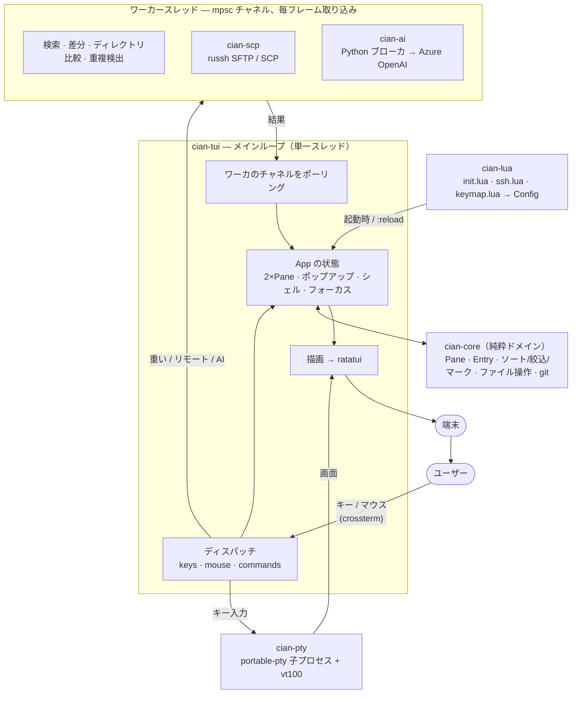

# cian

[English](README.md) · **日本語**

**C**omfortable **I**nterface for **A**gile File e**X**plorer **N**avigation —シェルを内蔵した、2ペイン型のターミナルファイラーです。 [AFXW（あふｗ）](https://akt.d.dooo.jp/akt_afxw.htm)に着想を得ています。

バイナリ1つ。どんなターミナルでも、macOS / Windows / Linux で動きます。ランタイムもDLLも要らないし、一緒に入れるものもありません。

---

## 使ってみる

```sh
cargo build --release
./target/release/cian
```

Windows では **Windows Terminal** か **WezTerm** で、Nerd Font を使ってください。アイコンや角丸がちゃんと出るのはそこです。（オフライン導入は一番下に。）

いつでも **`?`** で全キー一覧が出ます。今のキーマップから生成されるので、自分で割り当てたキーもそのまま載ります。シェルからは `cian -man` で同じものが、 `cian -h` でコマンドラインの使い方が出ます。

画面は既定で英語です。日本語にするなら `cian.set_option("lang", "ja")`、または右クリックメニューからその場で切り替えられます。

---

## 基本

2つのペインが左右に並びます。片方からもう片方へコピー・移動する — これが全部です。

| こう押すと | こうなる |
|---|---|
| **← / →** | 2つのペインのフォーカスを移す |
| **Enter** | フォルダに入る／書庫の中へ／ファイルは既定アプリで開く |
| **Alt+← / Alt+→** | このペインの履歴を戻る／進む（タイトルの **◀ ▶** クリックでも） |
| **Backspace** | 1階層上へ（先頭の `..` 行のクリックでも） |
| **`j` / `k`**・矢印 | カーソル移動 |
| **`Space`** | カーソル位置のファイルをマーク |
| **`c`** | マークしたファイルを反対ペインへコピー |
| **`m`** | 反対ペインへ移動 |
| **`d`** | 削除（ゴミ箱／ごみ箱へ） |
| **`r`** | リネーム |
| **`a` / `A`** | 新規ファイル / 新規フォルダ |
| **`u`** | 直前のリネーム／作成／移動を取り消し |
| **`F3`** | カーソル位置のファイルの中身を見る |
| **`?`** | 全キー一覧 |

コピー・移動・削除は必ず**先に確認**が入り、削除はゴミ箱行き。だからうっかりやっても何も失いません。`u`（または `:undo`）は直前のリネーム・作成・移動を数手ぶん遡って戻せます。

大きなコピーはバックグラウンドで進捗バー付き。途中で止めたいときは **Esc**。

**マウスもどこでも使えます。** クリックでカーソル移動、ダブルクリックで開く。ファイルを反対ペインへドラッグでコピー（Shift+ドラッグで移動）。ダイアログには本物のクリックできるボタンが付いていて、ホイールでポップアップをスクロールできます。境界線をドラッグすればその分割の比率を変えられます。

**デスクトップとの出し入れ。** Finder やエクスプローラから cian のウィンドウにファイルをドラッグすると、フォーカス中のペインへ**移動**します（いつも通り先に確認が入るので、誤ドラッグはそこで止められます）。ターミナルはドロップされるとパスを打ち込んでくるので、cian はそれを受け取っています — ただし**全部が実在するファイルのときだけ**なので、普通の貼り付けは普通の貼り付けのままです。逆向きはドラッグにできません：ターミナル上のプログラムは自分のウィンドウを持たないため、OS のドラッグ**元**になれないからです。代わりが **`Shift+P`** で、選択をOSのファイル参照としてクリップボードに載せます。Finder やエクスプローラで `Cmd/Ctrl+V` すれば貼り付きます。ブラウザのアップロード枠へは、**参照**ボタンを押してファイルダイアログにパスを貼るのが確実です。

**操作はキューに並びます。** コピー中に別のコピーを始めても拒否されず、順番待ちになって自動で流れます。進捗ポップアップは `b` で畳んで作業続行（ステータスチップ `⏳ copying 45% +2` が追跡）。`:queue` で実行中と待ち行列を一覧、`x` で停止／待ちの取り消し。アップロード・ダウンロードの失敗は自動で2回までリトライ。転送が固まったら — 30秒バイトが動かないと — チップが `⚠ 停滞` に変わり、`:queue` でもう一度 `x` を押すと**応答しないワーカーを見捨てて**残りのキューを進めます。

**長い処理は終わったら教えてくれます** — 数秒以上かかったコピーや転送は、終了時にベルを鳴らしデスクトップ通知を出すので、席を外していてもOK。トグル（`T`）か `cian.set_option("notify", false)` でオフにできます。

---

## すばやく移動する

打つたびに絞るファジーピッカー群 — 数文字打って Enter：

| 操作 | 動作 |
|---|---|
| **`C`**（または `:palette`） | コマンドパレット — *どの*コマンドもあいまい検索 |
| **`Z`**（または `:jump`） | 最近／ブックマークのフォルダへジャンプ |
| **`:files`** | ツリー全体のライブ・ファイル検索 — Enter でそのファイルを表示 |
| **`:recent`** | このセッションで開いたファイル |
| **`T`**（または `:toggles`） | ライブ設定を一箇所で切替 — 隠しファイル・入力同期・通知・転送後ベリファイ・言語 |
| **`:du`** | 容量分析 — 大きい順、`Enter` でフォルダに入る |

数ファイルをマークしたら **`:each <cmd>`** で各ファイルにコマンド実行 — `:each gzip {}`（`{}` がファイル）や、末尾にパスが付く `:each md5sum`。

---

## 中を見る — `F3`

ファイルに `F3`。cian を離れずに中身を見せます。

- **テキスト** — 行番号付きのスクロールビューア。シンタックスハイライト対応（Rust, Python, JS/TS, Java, HTML, CSS, SQL, shell, Lua, YAML, JSON …）。
- **Markdown** — その場でレンダリング表示。`p` でプレビュー↔ソース切替。
- **画像**（`.png/.jpg/.gif/.bmp/.webp`）— ターミナルに描画。グラフィックプロトコル対応ターミナル（kitty・iTerm2・WezTerm・sixel — 起動時に自動判定）なら実ピクセルで鮮明に、それ以外はハーフブロックセルで粗く表示します。
- **Office / PDF**（`.docx/.xlsx/.pptx/.pdf`、旧 `.doc/.xls/.ppt` も）— テキストを抽出。変換ソフトは要りません。
- **書庫**（`.zip/.jar/.tar/.tar.gz/…`）— 中身の一覧。`Enter` でカーソルの1件を反対ペインへ、`a` で全部を展開。

**書庫の中に入れます。** 一覧で zip や tar に `Enter` すると、ペインが書庫の*中*に入り、フォルダと同じように歩けます：メンバーのディレクトリへ潜り、`..`（または `h`）で戻り、ルートを越えると書庫ファイルの上に立っています。メンバーに `F3` すれば本物のビューアが開きます（コードは色つき、画像も Office も — F3 でできることは全部）。反対ペインへのコピーは展開で、**今立っている場所からの相対**です — `a/b/` の中から `c/` をコピーすれば `c/` だけができて、書庫のツリー全体は再現されません。そして **zip なら逆向きも**動きます：書庫ペインへ向かってコピーすれば立っている場所へ追加（同名は確認の上で置き換え）、`F2` でメンバーのリネーム（ディレクトリごとも可）、`d` でメンバー削除。zip はアトミックに書き直され、残るメンバーは再圧縮なしの raw コピーです。tar/tar.gz は読み取り専用のまま（形式上、安価な書き直しができません）。パスワード付き zip は変更しません — AES 書庫に平文を混ぜると「保護されているように見えるだけ」の物ができるためです。

ビューアは vim 風：`h j k l`・`w b`・`0 $`・`gg G`・`Ctrl-d/u` で移動、`/` で検索、 `42G` で行ジャンプ、`%` で対応する括弧へ。`v` / `V` / `Ctrl-v` で選択、`y` でコピー。Shift_JIS は自動判別して最初から読めます（UTF-16 は BOM で判別）。判別が外れたときは `e` で強制切替。

**hex 編集と BOM。** バイナリファイル（F3 で hex ダンプ表示）に `i` でその場編集：16進数キーがカーソル下のバイトを上書きします — **上書きのみ**、挿入・削除なし。オフセットがずれず、サイズも変わらないから安全。`u` で取消、`Ctrl+S` は元ファイルの `.bak` を残してから保存。テキスト側では、見えない BOM がビューアのタイトルに見えるバッジ（`· UTF-8 BOM`）になり、`:nobom` が確認の上でマークしたファイルから除去します。UTF-16 の BOM は検出してあえて残します — 無いとバイトオーダーが分からなくなるので。

**クラウド上のファイルは、言われるまで降ろしません。** 同期した OneDrive / Teams のライブラリ（iCloud Drive や Google ドライブも）には、**実際にはダウンロードされていない**ファイルが並びます。読むとその場でネットワーク越しに実体化されるので、チーム共有で `Ctrl+F` を一発打っただけでライブラリ丸ごと降りてくる、ということが起こり得ます。cian はそれを見分けます：プレースホルダのあるペインにだけ **☁** 列が出て（無いペインでは1桁も使いません）、一括処理 — grep・`:count`・`:hash`・`:dupes`・`:preview` — は飛ばした上で「N件スキップ」と報告します。意図的な操作は今まで通り：`F3`・コピー・ファイルを開く、はそのファイルを指定しているので実体化して構いません。一括処理にもクラウドを読ませたいときはトグル（`T`）の `☁ クラウド上のファイルも読む`、または `cian.set_option("read_cloud_files", true)`。

**カーソル追従プレビュー — 既定でON。** シェル枠の領域がカーソルの当たっているものをその場でプレビューします：コードはシンタックス色つき、画像は（対応ターミナルなら）実ピクセル、フォルダ・書庫は一覧、Office/PDF はテキスト。**シェルは下で動き続けていて、画面を借りているだけ**。`Shift+J`（またはクリック）でシェルにフォーカスすれば本来の画面に戻り、ファイルペインに戻ればまたプレビュー。両ペインはずっと見えたまま。リモート（SFTP）ペインはあえてプレビューしません — カーソルが触れるたびダウンロードになってしまうので。切りたいときは `:preview`（またはトグルメニュー）、起動時からOFFなら `cian.set_option("preview", false)`。

**置換 — ビューアで `:`。** `s/old/new/` と、効くフラグ一式：`g` 行内の全マッチ、`c` 1件ずつ確認（`y` / `n` / `a` 残り全部 / `q` 中止）、`i` 大小無視。パターンは cian の検索と同じ規則 — 素で書けばリテラル、`/re/` なら正規表現で、置換側では `${1}` 形式のグループが展開されます。置換文字列の `\n` や `\t` は本物の文字なので、`s/;/;\n/g` で行を分割できます。`v`/`V` の選択範囲に限定も可能。置換全体で undo 1回分です。

改行コードはタイトルに出て（`· CRLF`）、**保存時に維持**されます — Windows のファイルを開いて読んだだけで LF に書き換わることはありません。`:lf` / `:crlf` で意図的に変換できます。

**見えない文字。** TAB・行末の半角空白・全角空白・改行コードを、それぞれ `→` `·` `□`、改行は LF が `↓`・CR が `↵` で描きます。何も無いように見えて厄介ごとを起こすのは、まさにこれらなので。`:ws` で消せます。タブ幅は既定で4桁、`cian.set_option("tab_width", 8)` で広げられます。タブ区切りのファイルが揃うかどうかはここで決まります（4桁だと、4文字のフィールドはちょうど1桁ぶんを埋めきってタブが次の停止位置へ進むので、続く列は8桁目から始まります。一方2桁の `あ` は4桁目から。これはタブの仕様であって、直すべき不具合ではありません）。

**保存はファイルをそのまま返す。** ビューアはタブを4桁幅で描きますが、保持しているのはタブそのものです。書き戻されるのはファイル自身の文字 — 開いたときの BOM、開いたときの改行コード、そしてタブ。どれも画面上では見えず、どれもファイルへの実質的な変更なので、意図したとき以外は起きません：BOM を落とすのは `:nobom`、改行コードを変えるのは `:lf` / `:crlf`、タブと空白を交換するのは `:expand` / `:unexpand` です。

**クリップボードが無くてもコピー＆貼り付け。** ヤンクした内容は OS のクリップボードだけでなく cian の中にも保持し、貼り付けはクリップボードに何かあればそれを、無ければ内部の方を使います。SSH 越しのマシンにはたいていクリップボードサービスなど無く、同じファイルの別の場所に3行コピーするのにそれが要るのは筋が通らないので。

**読んでいるものについて聞く。** ビューアで右クリック（キーボードなら `Shift+Enter`）すると、**ファイルの上に重ねて**短いメニューが出ます：この文章を推敲、コマンドを説明・作成、このコードを点検・修正 — いずれも選択範囲（選択が無ければファイル全体）に対して。ほかにコピーとテーマ変更。答えを待つ間もファイルは閉じずに脇へ避け、チャットを閉じると戻ってきます。質問はそのファイルについてのものですし、未保存の編集が入っているかもしれないので。

**SharePoint にある Office 文書。** どのローカルフォルダが同期ライブラリなのかを教えてください — `cian.sharepoint{ { local = …, url = … } }`。同期中のライブラリは見た目がただのディレクトリで、推測を外すのは教えてもらうより悪い結果になるので。設定すると `:office` が **クラウド側の実体**を Word や Excel に渡します。同期されたローカルファイルではありません — そちらを開くと、あとで突き合わせる必要のあるコピーになりますが、`ofe|u|` の URI ならチェックアウトと共同編集が効きます。`:officelink` は同じ住所への `.url` ショートカットを書き出します。メールに貼るのはこちらです（誰か1人の同期フォルダではなくライブラリを指すので、受け取った側でも開けます）。どちらも右クリック ▸ OS のメニューにあり、意味を持つときだけ現れます。

**書庫の中のファイルを編集する。** zip の中のメンバに `F3`、編集して保存すると、**zip に書き戻します**。誰も二度と見ない一時ファイルに残すのではなく。書庫は隣に丸ごと作り直され、完成したときだけ差し替わるので、途中で止まっても壊れた zip が残ることはありません。書き戻せなかったときはその旨と、編集内容が残っている一時ファイルの場所を言います — どこにも行かなかった作業について「保存しました」と言うわけにはいかないので。

**Enter は読むためのキー。** ファイルはビューアで開き、`Ctrl+Enter` でそのファイル自身のプログラムに渡します。この向きにしたのは、ファイルを「見る」のが日に百回の動作で、「起動する」のは時々だからです。ビューアは Esc で閉じられますが、誤って開いたアプリケーションは探して閉じる必要があります。ディレクトリでは Enter は今までどおり中へ入り、`Ctrl+Enter` は反対ペインで開きます — どちらも起動という意味にはなり得ないので。

**ルーラーと十字。** テキストの上に列の目盛りが出ます（5桁ごとに印、10桁ごとに数字）。カーソルのいる桁はそこで強調され、カーソルの行には本文側でも色が敷かれます。色はテーマの地色から一歩ずらしたもの（暗いテーマでは明るく、明るいテーマでは暗く）なので、文字を潰さずに見えます。カーソルの升目はページの2色を入れ替えたものなので、その上でも消えません。桁の縦線は引きません — ルーラーが既に示していますし、本文を貫く縦棒は読みやすさの持ち出しの方が大きいので。この現場で読まれるものの多くは桁位置が意味を持つ記録で、桁を目で数えさせないためのものです。`:ruler` で消せます。

**全選択。** `Ctrl+A` で一覧のファイルを全部マークします（`..` は操作対象のファイルではないので除きます）。ビューアではファイル全体を行単位で選択するので、`y` でファイルごとコピー、Esc で解除。同じ考えで、どちらになるかは目の前にあるものが決めます。端末が Ctrl を離さない場合は、届くキーに `mark_all` を割り当てるか `:markall` を使ってください。

**差分を見ながら編集する。** 2つ並べた状態で `=` を押すと、違う行に印が付きます（変更された行、片側にしかない行を、余白の色つきバーで）。`Tab` / `Shift+Tab` で差分から差分へ移動できます。**どちらのファイルも編集可能なまま**で、印は編集に追随するので、差分を潰せばその場で消えます。行を揃えるための空行は入れません — 空行を挟めば見た目は綺麗に揃いますが、ファイルに無い行がバッファに入ります。読むだけなら良くても、その中で編集するなら誤りです。レポートが欲しいときの `:diff` は今までどおり残っています。

**2つ並べて。** `Shift+F8` で左右分割、`Shift+F9` で上下分割、`Shift+F10` で解除 — シェルパネルと同じキーです（同じ操作なので）。反対側には次に開いているファイルが出ます。1つしか開いていなければ同じファイルの2つ目のビューになるので、長い設定ファイルの頭と末尾を並べて読めます。`Shift+H` / `Shift+L`、あるいは反対側をクリックで行き来します。動くのは**焦点だけ**で、ファイルは置いた側に留まります。見ていない側は暗くなります。解除すると、読んでいた方が残り、もう一方は捨てずにタブへ戻ります（未保存の編集があるかもしれないので）。

**複数ファイルを一度に。** マークして `F3` を押すと全部開き、`F2` / `Shift+F2` で行き来できます。上端には全ファイル名の並んだタブが出て、読んでいるものが強調されます。名前をクリックしても切り替わります。各タブは、他を見ている間もカーソル位置・折りたたみ・未保存の編集をそれぞれ保持します。`Esc` で閉じるのは**見ているファイルだけ**で、最後の1つを閉じたときにビューアが閉じます。

**ファイルの形。** アウトラインが知っている種類のファイル — Rust、Python、JavaScript、Java、C、シェル、SQL、Lua、Go、Ruby、Markdown、YAML、INI、CSS、Makefile — を開くと、左に見出しや定義の一覧が出て、カーソルが「入っている」項目が強調されます。`]]` / `[[` で前後に移動、項目をクリックでそこへジャンプ、`:outline` で列を閉じます。パーサではなく正規表現です：言語サーバのインストールも、先にビルドすることも要らず、ツールチェーンの無いサーバ上のストアドプロシージャにも効きます。関数を1つ見落とせばスクロール1回分の損。その交換条件は妥当だと考えました。規則の無い種類のファイルは、空の箱を出さずにその旨を伝えます。

**折りたたみ。** 同じアウトラインが「節がどこで終わるか」を知っているので、`Space`（または `za`）でカーソルのいる節を折りたたみ、`zA` でファイル全体を一度に切り替えます（ひとつでも開いていれば全部閉じ、全部閉じていれば全部開く）。余白の `▾` をクリックしても同じです。折りたたみが隠すのは見出しの「下」だけで見出し自身は残るため、全部閉じるとファイルは目次の姿になります（何も無くなるのではなく）。カーソルが閉じた折りたたみの中に取り残されることはありません — 途中で閉じれば見出しの上に出てきます。編集中は折りたたみが引っ込みます（入力している人から行を隠すのは、見えない場所に編集を落とす良い方法なので）。挿入モードを抜けると、読み直したアウトラインの上に戻ってきます。

**端末がキーを離さないとき。** Mac の端末は Ctrl+F を自分の検索窓に、Ctrl+Q をシステムの拡大に使うことがあり、届かなかったキーは処理のしようがありません。`:keys` は受け取ったキーをそのまま表示し、どちらのキーボードモードで動いているかも示します。`CIAN_LEGACY_KEYS=1` を付けると拡張キーボードの要求なしで起動します。そのうえで、実際に届くキーへ割り当てを移せます — `cian.set_keymap("alt+g", "grep_recursive")`。Ctrl しか経路のなかった操作にはコマンドも用意しました：`:w` `:q` `:grep` `:block`。制御文字で画面が乱れたら `:redraw` で一から描き直します。

**いま検索したものを置換する。** `/` で見つけたら `r`。置換プロンプトが**パターンを入れた状態**で開くので、あとは置換後の文字だけです（区切り文字はパターンに含まれないものを選ぶので、スラッシュだらけのパスでも壊れません）。Enter の前に `c` を足せば1件ずつ確認、足さなければ一括です。

**grep 結果の一括置換。** `Ctrl+F` でツリーを grep したら、結果画面で **`r`**。置換後の文字列を聞いたうえで、変更されるすべての行を一覧します — ファイル名・行番号・その行がどうなるか、そしてカーソル行については現在の内容も下に表示します。`Space` でその行を除外、`f` でそのファイルごと除外、`a` で全体を反転、`Enter` で書き込み。`Enter` までは 1バイトも書きません。書き込む時点で各ファイルを読み直し、プレビュー以降に内容が変わっていた行は触らずに数えて報告します（古い行番号のまま書くのが、この手の道具がデータを壊す典型なので）。読めなかったファイル — バイナリ、大きすぎ、クラウド未ダウンロード — は黙って飛ばさず、理由付きで表示します。

**行まるごと。** `V` で行を選び、`I` で全行の先頭に、`A` で全行の末尾に文字を入れます。末尾は**各行が実際に終わっている場所**で、桁は揃えません — 「これ全部にカンマを付ける」に空白の埋めは要らないので。

**矩形編集。** `Ctrl+V`（端末によって奪われるので `Ctrl+Q` / `Alt+v` / `:block` でも入れます）の矩形選択が、選ぶだけでなく編集できるようになりました：**`d`** で矩形を全行から切り取り、**`I`** / **`A`** は一度打った文字を全行の左端／右端に差し込み、**`c`** は矩形の中身を置き換えます。矩形は文字数ではなく**画面の桁**で数えます（全角は2桁）。日本語混じりの行に矩形をかけても、引いたとおりの長方形になります。桁の境目が全角文字の途中に来たときは、その文字ごと含めます — 文字を半分に割ることはできないので。桁に届かない短い行は、挿入なら空白で埋めて桁を揃え（列を編集する意味がそこにあるので）、削除なら手を触れません（矩形の中に消すものが無いので）。何行に効いても undo 1回分です。

**資料の整形。** 同じ `:` プロンプトに、テキストエディタを手放せない理由になっている整形が入っています。どれも `v`/`V` の選択範囲かファイル全体に効いて、undo 1回分：**`:sort`** / **`:rsort`** / **`:uniq`** で行の並べ替えと重複削除。**`:han`** / **`:zen`** で文字幅 — `:han` は全角英数を半角にし、**同時に**半角カナを全角にします（人が「半角に」と言うとき実際に望んでいるのはこの二方向です）。**`:expand`** / **`:unexpand`** で先頭TABと空白。**`:reindent`** は3人の手が入ってバラバラなインデントを一定の段に揃えます。**`:ws`** は見えない文字 — 行末空白・TAB・全角スペース — を表示します。それが不具合の正体である回のために。

**その場で編集：** ビューアのノーマルモードは vim の基本チェンジセット入り — `x` `dd` `D` `J` で削除・結合、`v`/`V` 選択を `d` で削除、`u` で取消、`i` `a` `o` `O` `I` で挿入モードへ（`Ctrl+S` で元の文字コードのまま保存、`Esc` で抜ける）。設定ファイルのちょい直しにエディタ往復は要りません。自分のエディタがいい？ **`E`**（または `:edit`）で `$VISUAL` / `$EDITOR`（無ければ nvim → vim → vi）を開き、戻ってきたら再読み込みします。

**書庫まわり：** `:zip` / `:tar` / `:targz` でマークしたファイルをまとめ、 `:zip -e` で暗号化zip。`:unzip`（右クリック **▸ ここに展開**）はカーソルの書庫を同名の新しいサブフォルダに展開します。ロック付きzipも F3 で中身は見えて、展開時にパスワードを聞きます。

---

## 探す

| こう押すと | こうなる |
|---|---|
| **`/`** | 入力に応じて一覧を絞り込み（Enter で確定、Esc で解除） |
| **`f`** | 今のフォルダ内のマッチを行き来 |
| **`Shift+F`** | このフォルダ以下を名前で検索 |
| **`Ctrl+F`** | ファイル内を grep — Enter でその行にジャンプ |
| **`b`** | ブランチビュー — 配下のサブツリーを1つのフラット一覧に |
| **`,`** | 名前 / サイズ / 日付 / 拡張子でソート（`n` `s` `d` `e`） |

検索はバックグラウンドで走り、見つかった端から表示します。**Esc** で中断、 `Enter` で結果へジャンプ。検索/grep の結果画面で **`p`** を押すと、マッチをペインに「パネル化」して、普通の一覧と同じようにマーク＆一括操作できます。

**パターンの書き方。** 検索の入力欄はどこでも — 名前検索・grep・ビューアの `/` — 同じ小さな言語が使えます：

| 入力 | 意味 |
|---|---|
| `エラー` | 普通の文字列（大文字小文字は区別しない）— `Error` も `ERROR` もマッチ |
| `/ORA-\d+/` | 正規表現（正規表現の流儀どおり、大文字小文字を区別する） |
| `/ora-\d+/i` | 同上の大文字小文字なし版 — フラグは `i` だけ |
| `/^ERROR/` | ERROR で*始まる*行（grep で） |
| `/\.(log\|trc)$/` | `.log` か `.trc` で終わる名前（名前検索で） |

スラッシュで囲めば正規表現、囲まなければ**打ったままの文字**（エスケープを気にしなくていい）。壊れた正規表現はその場で理由つきで弾かれ、**黙って別の解釈にフォールバックすることはありません**。構文は Rust の [`regex`](https://docs.rs/regex)（Perl 系。後方参照と先読みはなし）。

**文字コード。** grep は UTF-8 専用ではありません：UTF-8 として読めないファイルは **Shift_JIS** で読み直すので、いまだに SJIS で吐かれる業務ログ（Oracle の alert ログ、AIX のバッチ出力…）にも `エラー` がちゃんとヒットします。

`:hidden` でドットファイルの表示切替（既定は表示）。

---

## 比較と片付け

**比較 — `=`**（または `:diff`）。2つのペインを2つのファイルに向けて `=` を押すと **左右に並べて**差分を色分け表示（`n`/`N` で変更点を移動）。2つの**フォルダ**に向ければツリーをバイト単位で比較し、違いを一覧します。どちらの画面からも：

- **`>` / `<`** — ハイライト中のエントリを反対側へコピー（ファイルでもサブツリー丸ごとでも）。WinMerge 風の突き合わせ。
- **`]` / `[`** — ツリーを*丸ごと*片方向に同期：片側にしかない／差分のあるものを全部コピー。削除はせず、実行前に確認します。
- **`w`** — 比較結果を**左右並びの HTML か Markdown** で保存（拡張子で形式が決まる）。
- **`x`** — 何が変わったか AI に説明させる。

**重複 — `:dupes`**（右クリック **重複ファイルを検出**）は、現在ペイン配下のバイト一致ファイルを探してチェックリストで表示。各グループ1つを残す側にして、残りは通常の削除確認に渡します。

**一括リネーム — `:brename`** はマークしたファイルをパターンでリネーム（AIもネットワークも不要）。テンプレート（`report_{n3}.{ext}` → `report_001.log` …）か、置換（`s/IMG/photo/i`）。`旧 → 新` を確認して、適用するものにチェックを入れます。

**エディタでリネーム — `:bulkrename`**（または `:vidir`）はマークした名前 — 無ければ一覧全部 — を1行1件のテキストとしてエディタで開きます。好きに書き換えて保存終了すると、変わった行だけリネーム（入れ替えもOK）。名前の重複・行の増減・衝突があればバッチごと中止して、中途半端には適用しません。`:cq` でキャンセル。

---

## 属性・容量・VCS

| コマンド | 内容 |
|---|---|
| `:attr` | 選択の権限・所有者を表示 |
| `:chmod 644` | モード変更（8進。Windows は `:readonly` を使う） |
| `:readonly on\|off` | 読み取り専用ビットの切替 |
| `:hash md5` / `:hash sha256` | 選択ファイルのチェックサム |
| `:count` | 対象配下のファイル数・行数・「ステップ数」を集計 |

ステータス行にはアクティブペインのドライブの**空き容量**が常に出ます（`12.3G free / 100G`）。80%超で琥珀、95%超で赤。

**バージョン管理はそのまま効きます。** **git** / **svn** の作業コピーなら、各行に状態バッジ（`●` ステージ済 / `✚` 変更 / `?` 未追跡 / `‼` 競合）、ステータス行にブランチ（または `svn r123`）、F3 で HEAD との変更行マーク。選択に対して `:stage`・`:unstage`・`:discard`・`:gitlog`・`:gitdiff`、ビューアで `B`（blame）が使えます。すべて右クリック **Git ▸** / **SVN ▸** にも。PATH の `git`/`svn` を呼び出します。

---

## SSHでファイル転送

ホストを一度設定しておけば（下記）、右クリック **Transfer ▸** に **Upload → server** と **Download ← server** が出ます（ファイラでもシェルでも）。

- **アップロード** — ホスト/ユーザを選び、アップ先フォルダを入力、必要なら chmod を指定して、マークしたファイルを送ります。
- **ダウンロード** — サーバ側を階層移動（Enter で入る、`Space` でマーク）して、保存先を選ぶ：左ペイン / 右ペイン / デスクトップ / パス入力。

**サーバをペインの*中*で開く — `:sftp`**（`:remote` / `:scp` でも）。片方のペインがリモートホストになり、**カーマイン色**の枠でローカルと見間違えません。普通のペインと同じように移動でき（`Enter`/`l` で入る、`-` で上、矢印でペイン切替）、そこから：

- **`c` コピー / `m` 移動**（境界をまたぐ）— ローカル↔サーバ、さらにサーバ↔サーバ（この端末を経由して中継）。移動は確認あり。
- **`A` / `a` / `r` / `d`** — サーバ上でフォルダ作成 / ファイル作成 / リネーム / 削除。フォルダ削除は中身ごと再帰的。サーバにゴミ箱はないので必ず確認します。
- **`F3`** でリモートファイルを開き、編集して保存すると**そのままアップロードし直し**。
- **`Esc`** で抜けると、ペインはローカルに戻ります。

外部の `scp` は使わないピュアRust実装。まず **SFTP**、無ければ古典的な **SCP** にフォールバックし、どちらで運んだかはステータス行に出ます。**転送後ベリファイ**をオンにすると、転送後にリモートを読み直して両端のチェックサムを突き合わせます：

```lua
cian.set_option("verify_transfers", true)   -- 既定はオフ
```

**接続 — `Shift+S`**（`:ssh`、右クリックでも）で2段階ピッカー：ホスト→ユーザ。コマンドはシェルに入力されるので、自分のシェル設定やエージェントが効きます。ホストは `init.lua` に：

```lua
cian.ssh({
  users = { "root", "deploy", "app" },          -- 全ホスト共通の候補
  hosts = {
    { name = "web1", host = "10.0.1.11" },
    { name = "db1",  host = "10.0.2.31", users = { "postgres", "root" } },
    { name = "bast", host = "203.0.113.9", port = 2222 },
  },
})
```

**パスワード**は任意。ssh が聞いてきたら cian が打ち込みます（SFTP/SCP の認証にも使う）。3通り：

```lua
users = {
  { name = "postgres", password = "..." },                -- このファイルに直書き
  { name = "deploy",   password_cmd = "pass srv/deploy" }, -- 資格情報ストアから取得
  "root",                                                  -- 鍵認証。何も保存しない
}
```

平文の `password` は便利だけど、ファイルに秘密を置くということです（Unix ではそのファイルが誰でも読める権限だと起動時に警告します）。`password_cmd` なら資格情報マネージャに任せられるし、鍵認証ならそもそも保存不要。パスワードはログにも画面にも出さず、ホスト鍵の確認を勝手に答えることもありません。

---

## シェルパネル

下のパネルは本物のシェル（あなたの `$SHELL`）です。**`Shift+J`**・クリック・ `:shell` でフォーカス、**Esc** でファイルへ戻ります。全画面プログラム（vim, less, htop）には Esc もファンクションキーもそのまま渡します。

シェルペイン内はドラッグで選択でき、離した時点でクリップボードにコピー（修飾キー不要）。**右クリック**でメニュー：SSH接続、貼り付け、セッションログ、SFTP/SCP、文字コードピッカー。

**タブと分割**はファンクションキー：

| キー | 操作 |
|---|---|
| `F1`–`F8` | シェルタブ 1–8 へ |
| `F9` / `F10` | 新規タブ / タブを閉じる |
| `Shift+F1` / `Shift+F2` | 次 / 前の分割ペインへ |
| `Shift+F8` / `Shift+F9` | アクティブペインを分割 — 左右 / 上下 |
| `Shift+F10` | アクティブな分割を閉じる（確認あり） |
| `F12` / `Shift+F12` | 画面全体 / 分割だけをズーム（トグル） |

**入力の同期**は右クリック **▸ Synchronize input**（または `:sync`）。一度打つとタブ内の全ペインに同時入力されます。オンの間はペインが明るい **⇄ SYNC** の縁になるので見間違えません。

**スニペット** — 何度も打つ定型行。一度書いておけば：

```lua
cian.snippets{
  { name = "sqlplus dev", cmd = "sqlplus user@DEVDB", enter = false },
  { name = "tail app log", cmd = "tail -f /var/log/app/app.log" },
  { name = "hulft send",  cmd = "utlsend -f SENDID -sync", confirm = true },
}
```

**Ctrl+Shift+Enter**（`:snip`、右クリックでも）でランチャー。入力で絞り込み、 Enter でシェルへ送ります。`enter = false` は打ち込むだけ（実行前に確認できる）、 `confirm = true` は実行前に確認。

---

## マクロ

マクロは1キーでセッションを用意します。**`@`**（`:macros`、右クリックでも）で選択。2種類あります。

**レイアウトマクロ**は「画面」を組みます：パネルを分割、各ペインをSSH接続、色分け、ログ開始。

```lua
return {
  { name = "本番: db + app + logs", panes = {
    { cmd = "ssh admin@db",  bg = "40,24,24", log = "~/cian-logs" },
    { dir = "right", cmd = "ssh admin@app", bg = "24,40,24" },
    { dir = "down",  cmd = "ssh admin@app", steps = { "tail -f /var/log/app.log" } },
  }},
}
```

ペインごとに `dir`（`right`/`down`）、`cmd`、`steps`（`{ wait = 2 }` や `{ expect = "SQL>" }` でプロンプトを待てる台本ログイン）、`bg`、`log`。`from = N` でグリッドを組み、`zoom = true` で先に最大化、`sync = true` で組み上がり後に入力同期。詳しい例は [`examples/macro.lua`](examples/macro.lua) と [`examples/macro/`](examples/macro/)。

**スクリプトマクロ**は「ファイル操作」を自動化します — "マクロ"の AFXW 的な側面。 `run` 関数を与えて、Lua の `for` / `if` で駆動します：

```lua
return {
  name = "*.log をzip化して掃除",
  run = function(cx)
    local logs = cx.glob("*.log")
    if #logs == 0 then cx.message("ログなし") return end
    cx.zip(logs, "logs.zip")
    cx.delete(logs)                     -- ゴミ箱へ
    cx.message(#logs .. " 件をまとめました")
  end,
}
```

`cx` で使えるもの：**取得**（`dir`, `other`, `marked`, `cursor`, `list`, `glob`）、 **操作**（`copy`, `move`, `delete`, `rename`, `mkdir`, `zip`, `read`, `write`）、 **サブプロセス**（`sh("cmd")` → `{ code, out, err }`）、**パス補助**（`basename`, `stem`, `ext`, `join`, `exists`, `isdir`, `size`）、`message`。拡張子ごとの仕分け、日付フォルダへのバックアップ、改行コード統一、空ファイル掃除、各ファイルのチェックサム、`index.md` 生成…といった**12個の実例**を [`examples/macro/Escript.lua`](examples/macro/Escript.lua) に同梱しています。

**スニペット？ マクロ？** 1つのシェルでコマンド1〜2行 → スニペット。複数ペインを配線、あるいはファイル操作の一括処理 → マクロ。

**起動時に：** `cian --macro thing.lua` で起動と同時に実行（`.lua` を `cian.exe` に関連付ければダブルクリックで実行）、`--macro-name "..."` で設定内の名前付きマクロを実行。

---

## AI・crmaine（任意）

`cian.ai{...}` を設定するとローカルの AI アシスタントが付きます（自分を **カーマイン** と名乗ります）。設定しなければオフ。そして必ず人が最後に判断します —あなたの許可なしに実行も削除もしません。

| こう打つと | こうなる |
|---|---|
| `:ai` | チャット（Azure OpenAI 経由） |
| `:aicmd <やりたいこと>` | 今いるシェル（ローカル、またはSSH先のサーバ）に合ったコマンドを下書き（確認用。勝手には実行しない） |
| `:aicommit` | ステージ済み差分からコミットメッセージを下書き |
| `:aijunk` | 不要そうなファイルをチェックリストに → 通常の削除確認へ |
| `:aiorganize` | フォルダ分け案を提示 → 移動を承認 |
| `:airename` | AI がリネーム案 → `旧 → 新` を確認 |
| `:aisearch <…>` | 説明に近いファイルを結果一覧で |
| `:aierror` | 直前のシェルエラーを説明 |
| `:aidiff` | 表示中の差分を説明（差分画面の `x` でも） |
| `:ailog` | 選択中のログを診断 — エラー・時系列・推定原因 |
| F3 で `S` | 表示中のファイルを要約 |

**文脈を渡す。** `cian.ai_context("…")` に自分の環境（OS、デプロイ先、社内のお作法）を書いておくと、cian が全プロンプトの先頭に付けてくれます。サーバ固有の情報はホストに：`notes = "RHEL 8; Oracle 19c; …"` は、そのホストにログイン中のシェルなら自動で渡されます。

AI へは同梱の小さな Python ヘルパ経由で届きます（crmaine 拡張と同じ Windows ブローカー認証）— Python と少しのパッケージ以外に入れるものはありません。 `auth_mode = "mock"` は配線確認用のオフライン・エコー、`api_base_url` でローカルサーバ（Ollama, LM Studio）を指せます。cian が単一自己完結じゃなくなる唯一の場所なので、ここだけオプトインです。設定は [`examples/init.lua`](examples/init.lua)。

### crmaine — チームの RAG を cian から

チームで **crmaine**（VS Code 拡張）を使っているなら、cian はその起動済みローカルサーバにアタッチします — 同じインデックス・同じエンドポイント、追加インストールなし。VS Code で crmaine を起動し、init.lua に1行足すだけ（ポートとキャッシュ先は VS Code の設定から毎回読みます）：

```lua
cian.crmaine{}
```

| コマンド | こうなる |
|---|---|
| `:rag <質問>` | crmaine のインデックスに RAG 質問 — 回答はストリーミング表示 |
| `:agent <質問>` | エージェント回答（ツール実行の進捗も表示） |
| `:coding [質問]` | 現在のファイルのコードについて相談（F3 の `A` でも） |
| `:impact` / `:contradiction` / `:glossary` | コーパスの分析 |
| `:searchfiles <語>` | コーパスをキーワード検索してペインに一覧 |
| `:index [dir]` | フォルダを cian *専用*のインデックスに構築；`:ragshared` で crmaine 本体に戻す |
| `:raginfo` | 診断 — ポート・接続可否・使用中インデックス |

crmaine のチャットはカーマイン色（ローカルの `:ai` は **AI - simple** としてシアン色）で、どちらが答えたか一目で分かります：**Shift+Enter** で改行、**Ctrl+R** で過去の会話（再起動しても残る）、**Ctrl+↑ / Ctrl+↓** で直近回答を評価、**Esc** でストリーム中断。回答は Markdown 表示で、**参照元**も出ます。crmaine の各操作は右クリック **AI - crmaine ▸** メニューからも。

---

## 設定

cian は `~/.config/cian/init.lua` を読みます（`$CIAN_CONFIG_DIR` で変更可）。中身は Lua で、小さな `cian` テーブルに書きます — 無くても起動します：

```lua
cian.set_theme({ accent = "#00d7d7", mark_fg = "yellow" })
cian.set_option("clipboard_on_copy", false)
cian.set_keymap("x", "delete")           -- キー割当は既定を置き換える。"none" で無効化
cian.on_open("md", function(path)        -- .md を自分のやり方で開く
  cian.spawn({ "open", "-a", "Typora", path })
end)
```

設定が壊れていても起動は止まりません — cian はエラーを表示し、適用できなかった分は既定にフォールバックします。`:reload` で再起動せず読み直し（キーマップ・オプション・SSHホスト・open ハンドラ。テーマと枠線は再起動が必要）。

**テーマ。** 13種のプリセットをライブプレビュー：`:theme` でギャラリー、 `:theme <名前>` で直接、ペインごとに別テーマも可。選択は再起動しても残ります。

**ポータブル。** `init.lua`（`shortcuts.lua` / `macro.lua` も）を `cian` 実行ファイルの隣に置くと、`~/.config/cian` より優先されます — 読み込みも書き戻しも。バイナリと `.lua` を USB に入れれば設定ごと持ち歩けて、ホストには何も残しません。

**セッション。** パス指定なしで起動すると、前回開いていた2つのフォルダを開き直します。コマンドラインでフォルダを渡せば上書き。

**キーの再割り当て。** ファイルペインの各操作には名前があり、割り当てられます：

```lua
cian.set_keymap("x", "delete")   -- x でも削除
cian.set_keymap("d", "rename")   -- d をリネームに
cian.set_keymap("d", "none")     -- d を無効化
```

[`examples/init.lua`](examples/init.lua) は全既定バインドと全アクション名を載せた、コメント付きテンプレートです。**Windows のパスは長括弧で** — Lua ではバックスラッシュがエスケープになります：

```lua
cian.set_option("shell", [[C:\Windows\System32\WindowsPowerShell\v1.0\powershell.exe]])
cian.set_option("shell", "powershell.exe")   -- または PATH から引く素の名前
```

---

## どう組み合わさっているか

cargo ワークスペース、7クレート：

| クレート | 役割 |
|---|---|
| `cian-core` | 純粋ロジック：ファイル操作・マーク・ソート・検索・差分・重複・git |
| `cian-tui`  | 描画と入力（ratatui + crossterm）、レイアウト、ポップアップ、マウス |
| `cian-pty`  | 組み込みシェル（portable-pty + vt100） |
| `cian-scp`  | 組み込み SFTP/SCP 転送（ピュアRust russh） |
| `cian-ai`   | 任意のAIヘルパー（同梱 Python 経由で Azure OpenAI） |
| `cian-lua`  | Lua 設定ホスト（mlua）：キーマップ・テーマ・マクロ |
| `cian-bin`  | エントリポイント — `cian` バイナリを生成 |

1本のメインループが UI と描画をすべて持ちます。ブロックしうる処理 — 検索・差分・転送・AI — はワーカースレッドで走り、その結果を毎フレーム取り込みます。だから UI は固まりません。



---

## Windows（オフライン）インストール

cian は自己完結の `cian.exe` 1つ — 実行時にランタイムもDLLもネットワークも不要。 Windows 開発機なしで x64 ビルドを得るには、同梱の GitHub Actions ワークフローを使います（本物の Windows ランナーでビルドし、持ち運べる zip にまとめます）：

1. タグを push（`git tag v0.1.0 && git push --tags`）、または **Actions → release → Run workflow**。
2. その実行の成果物から `cian-windows-x64.zip` をダウンロード。
3. オフライン機に持ち込んで展開し、`cian.exe` を直接実行するか、PATH に入れる：

   ```powershell
   powershell -ExecutionPolicy Bypass -File .\install.ps1
   ```

既定は現在ユーザー向け（管理者不要）で `%LOCALAPPDATA%\Programs\cian` へ。全ユーザー向けにするなら管理者 PowerShell で：

   ```powershell
   powershell -ExecutionPolicy Bypass -File .\install.ps1 -Dest "C:\Program Files\cian" -AllUsers
   ```

新しいターミナルを開いて `cian`。ファイルタイプのアイコンには Nerd Font のターミナル（Windows Terminal / WezTerm）を使ってください。

---

## 知っておくと便利

- **どのビルド？** `cian --version` でビルド時に焼き込まれたコミットが出ます。 PATH に残った古い `cian.exe` は、機能が無いバグに見えるので最初に確認を。
- **枠線の角** は、レガシーな Windows コンソールでは四角、それ以外は角丸が既定（一部のコンソールフォントに角丸がないため）。固定するなら `cian.set_option("borders", "rounded")`（または `"plain"`）。
- **調子が変？** `CIAN_LOG=/tmp/cian.log` で診断ログを取れます。パニック時も終了前にターミナルを復元するので、`reset` が要る状態にはなりません。
