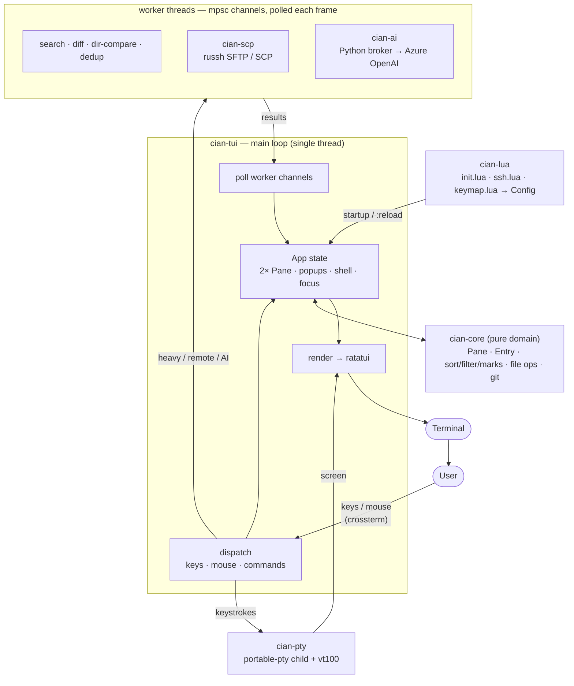

# cian

**English** · [日本語](README.ja.md)

**C**omfortable **I**nterface for **A**gile File e**X**plorer **N**avigation — a two-pane terminal file manager, with a real shell built in. Inspired by [AFXW (あふｗ)](https://akt.d.dooo.jp/akt_afxw.htm).

One binary. Runs in any terminal, on macOS, Windows and Linux. No runtime, no DLLs, nothing to install alongside it.

---

## Try it

```sh
cargo build --release
./target/release/cian
```

On Windows, use it inside **Windows Terminal** or **WezTerm** with a Nerd Font — that's where the icons and rounded corners look right. (Offline install is at the bottom.)

Press **`?`** any time for the full key list. It's generated from your live keymap, so keys you rebind show up too. `cian -man` prints it from a shell, `cian -h` prints the command-line usage.

The UI is English by default. Want Japanese? `cian.set_option("lang", "ja")`, or flip it from the right-click menu.

---

## The basics

Two panes side by side. You copy and move between them — that's the whole idea.

| Do this | And… |
|---|---|
| **← / →** | move focus between the two panes |
| **Enter** | enter a folder, go inside an archive — or open a file with its default app |
| **Alt+← / Alt+→** | back / forward through this pane's history (or click **◀ ▶** in the title) |
| **Backspace** | go up a level (or click the `..` row at the top) |
| **`j` / `k`**, arrows | move the cursor |
| **`Space`** | mark the file under the cursor |
| **`c`** | copy the marked files to the other pane |
| **`m`** | move them to the other pane |
| **`d`** | delete (to the Recycle Bin / Trash) |
| **`r`** | rename |
| **`a` / `A`** | new file / new folder |
| **`u`** | undo the last rename / create / move |
| **`F3`** | look inside the file under the cursor |
| **`?`** | the full key list |

Copy, move and delete always **ask first**, and delete goes to the trash — so a slip never costs you anything. `u` (or `:undo`) walks back the last few renames, creates and moves too.

Big copies run in the background with a progress bar; **Esc** stops one.

**Mouse works everywhere.** Click to move the cursor, double-click to open. Drag a file onto the other pane to copy it there (Shift-drag to move). Every dialog has real clickable buttons, and the wheel scrolls any popup. Drag a border to resize the split it divides.

**Files in and out of the desktop.** Drag files from Finder or Explorer onto the cian window and they **move** into the focused pane — after the usual confirm, so a mistaken drag is caught there. (Any terminal answers a drop by typing the paths in; cian takes that only when every item really is a file, so an ordinary paste stays an ordinary paste.) The other direction cannot be a drag: a terminal program has no window of its own and so can never be an OS drag *source*. **`Shift+P`** is the bridge instead — it puts the selection on the clipboard as real file references, and `Cmd/Ctrl+V` in Finder or Explorer pastes them. For a browser's upload box, use its **Browse** button and paste the path into the file dialog.

**Operations queue.** Start a copy while another runs and it waits its turn — nothing is refused, nothing overlaps. The progress popup's `b` tucks it away so you keep working (a status chip tracks it: `⏳ copying 45% +2`); `:queue` lists the runner and the line, `x` stops the runner or removes a waiting item. Failed uploads/downloads retry themselves twice before giving up. And if a transfer wedges — no bytes for 30 s — the chip turns to `⚠ stalled`, and in `:queue` a second `x` *abandons* the deaf worker so the rest of the line keeps moving.

**Long jobs tell you when they're done** — a copy or transfer that runs more than a few seconds rings the bell and posts a desktop notification, so you can walk away. Turn it off in the toggles (`T`) or `cian.set_option("notify", false)`.

---

## Get around fast

A handful of fuzzy pickers — type a few letters, hit Enter:

| Do this | And… |
|---|---|
| **`C`** (or `:palette`) | command palette — fuzzy-find *any* command |
| **`Z`** (or `:jump`) | jump to a recent or bookmarked folder |
| **`:files`** | live file finder over this whole tree — Enter reveals the pick |
| **`:recent`** | the files you opened this session |
| **`T`** (or `:toggles`) | flip live settings in one place — dotfiles, input sync, notifications, verify-transfers, language |
| **`:du`** | disk usage — biggest first, `Enter` drills into a folder |

Marked a few files? **`:each <cmd>`** runs a command on each — `:each gzip {}` (`{}` is the file), or `:each md5sum` with the path appended.

---

## Look inside anything — `F3`

Press `F3` on a file and cian shows you what's in it, without leaving:

- **Text** — a scrollable viewer with line numbers and syntax highlighting (Rust, Python, JS/TS, Java, HTML, CSS, SQL, shell, Lua, YAML, JSON, …).
- **Markdown** — rendered right there. `p` toggles preview ↔ source.
- **Images** (`.png/.jpg/.gif/.bmp/.webp`) — drawn in the terminal. On a terminal with a graphics protocol (kitty, iTerm2, WezTerm, sixel — cian asks at startup) they render as real pixels; anywhere else as colored half-block cells, coarse but recognisable.
- **Office & PDF** (`.docx/.xlsx/.pptx/.pdf`, plus legacy `.doc/.xls/.ppt`) — their text, no converter needed.
- **Archives** (`.zip/.jar/.tar/.tar.gz/…`) — the file list. `Enter` extracts the highlighted member to the other pane, `a` extracts all.

**Walk into archives.** `Enter` on a zip or tarball doesn't just list it — the pane goes *inside*, and the archive browses like a folder: descend into member directories, `..` (or `h`) climbs back out, and past the root you're standing on the archive file again. `F3` on a member opens the real viewer on it (code with colour, images, Office text — everything F3 does). Copying to the other pane extracts, relative to where you're standing — copy `c/` from inside `a/b/` and you get `c/`, not the archive's whole tree. And for **zip**, it works the other way too: copy files *toward* the archive pane and they're added right where you stand (same names replace, after a confirm), `F2` renames a member (directories included), `d` deletes members — the zip is rewritten atomically, kept members raw-copied without recompression. tar/tar.gz stay read-only (their format has no cheap rewrite), and password-protected zips are never modified — mixing cleartext into an AES archive would only look protected.

The viewer is vim-flavoured: `h j k l`, `w b`, `0 $`, `gg G`, `Ctrl-d/u` move; `/` searches, `42G` jumps to a line, `%` to the matching bracket. `v` / `V` / `Ctrl-v` select, `y` copies. Shift_JIS files are detected and decoded automatically (UTF-16 via BOM); `e` still forces an encoding when the guess is wrong.

**Hex edit & BOM.** `i` on a binary file (F3 shows it as a hex dump) edits it in place: hex digits overwrite the byte under the cursor — overwrite *only*, no insert or delete, so offsets never shift and the size can't change — `u` undoes, and `Ctrl+S` saves after writing a `.bak` of the original. For text files, an invisible byte-order mark gets a visible badge in the viewer title (`· UTF-8 BOM`), and `:nobom` strips it from the marked files after a confirm. UTF-16 BOMs are detected and deliberately kept — without one, a UTF-16 file's byte order is guesswork.

**Cloud files stay in the cloud until you say otherwise.** A synced OneDrive / Teams library — or iCloud Drive, or Google Drive — lists files that haven't actually been downloaded. Reading one pulls it over the network, so a single `Ctrl+F` across a team library could quietly drag the whole thing down. cian sees them: a **☁** column appears in panes that hold placeholders (and nowhere else), and the sweeps — grep, `:count`, `:hash`, `:dupes`, `:preview` — skip them and tell you how many they skipped. Deliberate acts still work normally: `F3`, a copy, opening a file are you asking for that file. Flip `Read ☁ cloud-only files` in the toggles (`T`), or `cian.set_option("read_cloud_files", true)`, when you do want a sweep to reach into the cloud.

**Cursor-follow preview — on by default.** The shell panel's area previews whatever the cursor is on, as you move: code with syntax colour, images (real pixels on capable terminals), folder and archive listings, Office/PDF text. The shell keeps running underneath — only its pixels are borrowed. `Shift+J` (or a click) focuses the shell and shows it again; move back to a file pane and the preview returns. Both file panes stay visible the whole time. Remote (SFTP) panes deliberately show no preview — it would download every file the cursor touches. `:preview` (or the toggles menu) turns it off; `cian.set_option("preview", false)` starts it off.

**Replace — `:` in the viewer.** `s/old/new/` with the flags that matter: `g` for every match on a line, `c` to be asked about each one (`y` / `n` / `a` all / `q` stop), `i` to ignore case. The pattern follows the same rule as every search in cian — bare is a literal, `/re/` is a regex, and `${1}` style groups expand in the replacement. `\n` and `\t` in the replacement are real characters, so `s/;/;\n/g` splits a line. A `v`/`V` selection limits the range. The whole replace is one undo step.

Line endings are shown in the title (`· CRLF`) and **preserved on save** — opening a Windows file to read it never quietly rewrites it as LF. `:lf` / `:crlf` convert on purpose.

**A save gives the file back.** The viewer draws a tab four columns wide, but it keeps the tab: what is written back is the file's own characters, with the byte-order mark it arrived with, the line ending it arrived with, and its tabs. Each of those is invisible on screen and each is a real edit to the file, so none of them happens except on purpose — `:nobom` drops a BOM, `:lf` and `:crlf` change the line ending, `:expand` and `:unexpand` trade tabs for spaces.

**The shape of a file.** Open anything the outline knows — Rust, Python, JavaScript, Java, C, shell, SQL, Lua, Go, Ruby, Markdown, YAML, INI, CSS, a Makefile — and a column down the left names its headings and definitions, with the one the cursor is *inside* highlighted. `]]` and `[[` step through them, clicking one jumps there, and `:outline` puts the column away. It is regular expressions rather than a parser: no language server to install, no project to build first, and it works on a stored procedure over SSH on a machine with no toolchain. A missed function costs one scroll, which is the right trade for that. A file type it has no rules for says so instead of showing an empty box.

**Folding.** The same outline says where a section ends, so `Space` (or `za`) folds the one the cursor is in, `zA` takes the whole file either way — anything still open means close it all, everything closed means open it all — or click the `▾` in the gutter. A fold hides what is *under* its heading and never the heading itself, so closing everything collapses the file to its table of contents rather than to nothing. The cursor never sits inside a closed fold: close one from the middle and it comes out onto the heading. Folds step aside while you are editing — hiding lines from someone who is typing is a good way to lose an edit into a region they cannot see — and come back when you leave insert mode, against a freshly-read outline.

**When the terminal keeps a key for itself.** A Mac terminal may take Ctrl+F for its own find bar and Ctrl+Q for the system zoom, and a key that never arrives cannot be handled. `:keys` reports each keystroke as cian received it, and names which keyboard mode is in effect; `CIAN_LEGACY_KEYS=1` starts without the enhanced-keyboard request. Bindings can then be moved somewhere your machine will actually deliver — `cian.set_keymap("alt+g", "grep_recursive")` — and the shortcuts that only had a Ctrl route also answer to a command: `:w`, `:q`, `:grep`, `:block`. `:redraw` repaints from nothing when a stray control character scrambles the screen.

**Replacing across a grep.** `Ctrl+F` greps the tree; **`r`** on the results asks what the matched text should become and then shows you every line it would change — file, line number, and what that line ends up as, with the current text of the row under the cursor shown beneath. `Space` spares a line, `f` spares the rest of the file, `a` flips the lot, `Enter` writes. Nothing reaches the disk before `Enter`, and at that point each file is re-read: any line whose text has moved on since the preview is left alone and counted, because a bulk write against a stale line number is how tools like this eat data. Files it could not read — binary, too large, a cloud placeholder — are named rather than passed over in silence.

**Whole lines.** `V` selects them, and then `I` and `A` put text at the start of every one, or at the end of every one — at each line's own end, without squaring them off first, because "put a comma on all of these" does not want padding.

**Rectangles.** `Ctrl+V` (or `Ctrl+Q`, `Alt+v`, or `:block` — terminals differ about which of these they will hand over) selects a block, and now edits one: **`d`** cuts the rectangle out of every line, **`I`** and **`A`** type text once and put it down the left or right edge of all of them, **`c`** replaces what the rectangle covers. The rectangle is reckoned in screen columns, not characters — a full-width character is two of them — so a block drawn over Japanese text is the rectangle you drew rather than a ragged edge, and an edge falling inside a wide character takes it whole. Lines too short to reach the column are padded for an insert (the point of a column edit is that it lines up) and left alone by a delete (there was nothing inside the rectangle to remove). One undo step, whatever it touched.

**Reshaping a document.** The same `:` prompt carries the transforms a text editor is kept around for, each acting on a `v`/`V` selection or the whole file, each one undo step: **`:sort`** / **`:rsort`** / **`:uniq`** for line order and duplicates; **`:han`** / **`:zen`** for width — `:han` makes full-width ASCII normal *and* half-width katakana normal, which are the two directions anyone actually means; **`:expand`** / **`:unexpand`** for leading tabs; **`:reindent`** to put a document indented by three different hands onto one ladder. **`:ws`** shows the characters you cannot see — trailing spaces, tabs, ideographic spaces — for the pass where one of them is the bug.

**Edit in place:** the viewer's normal mode carries vim's small change set — `x` `dd` `D` `J` delete and join, `d` cuts a `v`/`V` selection, `u` undoes, and `i` `a` `o` `O` `I` drop into insert (`Ctrl+S` saves in the file's own encoding, `Esc` leaves). Quick config surgery never needs an editor round-trip. Prefer your own editor? **`E`** (or `:edit`) opens it in `$VISUAL` / `$EDITOR` — or nvim → vim → vi — and reloads when you're back.

**Archives, more:** `:zip` / `:tar` / `:targz` bundle the marked files; `:zip -e` makes an encrypted one. `:unzip` (or right-click **▸ Extract here**) unpacks the file under the cursor into a fresh sub-folder. Locked zips still list their members on F3, and extracting one asks for the password first.

---

## Find things

| Do this | And… |
|---|---|
| **`/`** | filter the listing as you type (Enter keeps it, Esc clears) |
| **`f`** | jump between matches in the current folder |
| **`Shift+F`** | find by name, anywhere below this folder |
| **`Ctrl+F`** | grep inside files — Enter opens the hit right on its line |
| **`b`** | branch view — flatten this whole subtree into one flat list |
| **`,`** | sort by name / size / date / extension (`n` `s` `d` `e`) |

Search runs in the background and streams results as it finds them — **Esc** stops it, `Enter` jumps to a result. In the find/grep results, **`p`** "panelizes" the matches into the pane, so you can mark and operate on them like any other listing.

**Patterns.** Everywhere you type a search — find, grep, and `/` in the viewer — the same little language applies:

| You type | It means |
|---|---|
| `error` | plain text, case-insensitive — matches `Error`, `ERROR`, … |
| `/ORA-\d+/` | a regular expression (case-sensitive, as regexes usually are) |
| `/ora-\d+/i` | the same, case-insensitive — the only flag is `i` |
| `/^ERROR/` | lines *starting* with ERROR (grep) |
| `/\.(log\|trc)$/` | names ending `.log` or `.trc` (find) |

Wrap a pattern in slashes to make it a regex; leave it bare and it's the literal text you typed, no escaping to think about. A typo'd regex is rejected with its reason on the spot — it never falls back to matching something you didn't mean. The full syntax is Rust's [`regex`](https://docs.rs/regex) (Perl-like; no backreferences/lookaround).

**Encodings.** Grep isn't UTF-8-only: a file that doesn't decode as UTF-8 is retried as **Shift_JIS**, so the Japanese enterprise logs that are still SJIS (Oracle alert logs, AIX batch output…) actually match — searching `エラー` finds it whichever encoding the file is in.

`:hidden` shows or hides dotfiles (shown by default).

---

## Compare & clean up

**Compare — `=`** (or `:diff`). Point the two panes at two files and `=` shows them **side by side**, differences highlighted; `n`/`N` jump between changes. Point them at two **folders** and `=` compares the trees byte-for-byte and lists what differs. From either:

- **`>` / `<`** — copy the highlighted entry to the other side (a file or a whole subtree). WinMerge-style reconcile.
- **`]` / `[`** — sync the *whole* tree one way: copy everything one side has that the other lacks or differs on. It never deletes, and confirms first.
- **`w`** — save the comparison as a **side-by-side HTML or Markdown** report (the extension picks the format).
- **`x`** — ask the AI to explain what changed.

**Duplicates — `:dupes`** (or right-click **Find duplicate files**) finds byte-identical files under the current pane and shows them as a checklist; one per group is kept, the rest go through the normal delete confirmation.

**Bulk rename — `:brename`** renames the marked files by a pattern — no AI, no network. Either a template (`report_{n3}.{ext}` → `report_001.log`, …) or a substitution (`s/IMG/photo/i`). You review `old → new` and tick which to apply.

**Rename in your editor — `:bulkrename`** (or `:vidir`) opens the marked names — or the whole listing — as a text file in your editor, one per line. Edit any of them, save and quit, and each changed line renames that file (swaps included). The batch is all-or-nothing: a duplicate name, a lost line, or a collision cancels the whole thing rather than half-applying. `:cq` cancels.

---

## Files, attributes, space

| Command | Does |
|---|---|
| `:attr` | permissions & owner of the selection |
| `:chmod 644` | change the mode (octal; Windows → use `:readonly`) |
| `:readonly on\|off` | toggle the read-only bit |
| `:hash md5` / `:hash sha256` | checksum the selected files |
| `:count` | count files, lines and source "steps" under the target |

The status line always shows **free space** on the active pane's drive (`12.3G free / 100G`) — amber past 80% used, red past 95%.

**Version control just works.** In a **git** or **svn** working copy, each entry gets a status badge (`●` staged, `✚` modified, `?` untracked, `‼` conflict), the status line shows the branch (or `svn r123`), and F3 marks changed lines against HEAD. Act on the selection with `:stage`, `:unstage`, `:discard`, `:gitlog`, `:gitdiff`, and `B` in the viewer for a blame gutter — all under right-click **Git ▸** / **SVN ▸**. cian shells out to your `git`/`svn`.

---

## Transfer files over SSH

Configure your hosts once (below), and the right-click **Transfer ▸** menu gives you **Upload → server** and **Download ← server**, in a file pane or the shell.

- **Upload** — pick a host/user, type the remote folder, optionally set the mode (chmod), and the marked files go up.
- **Download** — browse the remote folder (Enter to open, `Space` to mark), then choose where they land: left pane, right pane, Desktop, or a typed path.

**Or browse the server *in* a pane — `:sftp`** (also `:remote` / `:scp`). One pane becomes the remote host, framed in **carmine** so you never mistake it for local. Move around like any pane (`Enter`/`l` in, `-` up, arrows switch panes), then:

- **`c` copy / `m` move** across the boundary — local↔server, or even server↔server (relayed through this machine). A move confirms first.
- **`A` / `a` / `r` / `d`** — new folder / new file / rename / delete on the server. Deleting a folder removes it recursively; the server has no trash, so it always confirms.
- **`F3`** opens a remote file; edit it (in place or with `E`) and saving uploads it straight back.
- **`Esc`** leaves and the pane returns to your local disk.

It's pure-Rust — no external `scp`. It uses **SFTP**, falling back to classic **SCP** on servers without an SFTP subsystem, and the status line says which. Turn on **verify** to re-read each transferred file and checksum both ends:

```lua
cian.set_option("verify_transfers", true)   -- off by default
```

**Connect — `Shift+S`** (or `:ssh`, or right-click) opens a two-stage picker: host, then user. The command is typed into the shell, so your own shell config and agent apply. Set your hosts in `init.lua`:

```lua
cian.ssh({
  users = { "root", "deploy", "app" },          -- offered for every host
  hosts = {
    { name = "web1", host = "10.0.1.11" },
    { name = "db1",  host = "10.0.2.31", users = { "postgres", "root" } },
    { name = "bast", host = "203.0.113.9", port = 2222 },
  },
})
```

**Passwords** are optional. cian types one when ssh asks for it (and uses it for SFTP/SCP). Three ways:

```lua
users = {
  { name = "postgres", password = "..." },                -- in this file
  { name = "deploy",   password_cmd = "pass srv/deploy" }, -- from a credential store
  "root",                                                  -- key auth; nothing stored
}
```

A plaintext `password` is convenient but it's a secret in a file — cian warns on Unix if that file is world-readable. `password_cmd` keeps it in your credential manager; key auth avoids the question entirely. The password is never logged, shown, or answered for a host-key prompt.

---

## The shell panel

The bottom panel is a real shell (your `$SHELL`). Focus it with **`Shift+J`**, a click, or `:shell`; **Esc** returns to the files. Full-screen programs (vim, less, htop) keep Esc and the function keys for themselves.

Drag inside a shell pane to select — it copies on release, no modifier needed. **Right-click** for its menu: SSH connect, paste, session log, SFTP/SCP, and a text-encoding picker.

**Tabs & splits** are on the function keys:

| Key | Action |
|---|---|
| `F1`–`F8` | switch to shell tab 1–8 |
| `F9` / `F10` | new tab / close tab |
| `Shift+F1` / `Shift+F2` | focus next / previous split pane |
| `Shift+F8` / `Shift+F9` | split the active pane — side by side / stacked |
| `Shift+F10` | close the active split (asks first) |
| `F12` / `Shift+F12` | zoom the whole surface / just the split (toggle) |

**Synchronize input** across a tab's panes with right-click **▸ Synchronize input** (or `:sync`) — type once, it goes to every pane at once. The panes wear a bright **⇄ SYNC** border while it's on, so you can't miss it.

**Snippets** — the lines you type over and over. Declare them once:

```lua
cian.snippets{
  { name = "sqlplus dev", cmd = "sqlplus user@DEVDB", enter = false },
  { name = "tail app log", cmd = "tail -f /var/log/app/app.log" },
  { name = "hulft send",  cmd = "utlsend -f SENDID -sync", confirm = true },
}
```

**Ctrl+Shift+Enter** (or `:snip`, or right-click) opens the picker; type to filter, Enter sends the line to the shell. `enter = false` types it for you to review, `confirm = true` asks first.

---

## Macros

A macro sets up your session in one keystroke. Press **`@`** (or `:macros`, or right-click) to pick one. Two kinds:

**Layout macros** build the *screen*: split the panel, SSH each pane somewhere, tint them apart, start logging.

```lua
return {
  { name = "Prod: db + app + logs", panes = {
    { cmd = "ssh admin@db",  bg = "40,24,24", log = "~/cian-logs" },
    { dir = "right", cmd = "ssh admin@app", bg = "24,40,24" },
    { dir = "down",  cmd = "ssh admin@app", steps = { "tail -f /var/log/app.log" } },
  }},
}
```

Per pane: `dir` (`right`/`down`), `cmd`, `steps` (a scripted login that can `{ wait = 2 }` and `{ expect = "SQL>" }` for a prompt), `bg`, `log`. Add `from = N` to build a grid, `zoom = true` to maximize first, `sync = true` to synchronize input once it's up. Full examples in [`examples/macro.en.lua`](examples/macro.en.lua) and [`examples/macro/`](examples/macro/).

**Script macros** automate *file operations* — the AFXW side of the word. Give a macro a `run` function and drive it with Lua's own `for` / `if`:

```lua
return {
  name = "Archive *.log, then bin them",
  run = function(cx)
    local logs = cx.glob("*.log")
    if #logs == 0 then cx.message("no logs here") return end
    cx.zip(logs, "logs.zip")
    cx.delete(logs)                     -- to the trash
    cx.message("archived " .. #logs .. " logs")
  end,
}
```

`cx` gives you: **query** (`dir`, `other`, `marked`, `cursor`, `list`, `glob`), **operations** (`copy`, `move`, `delete`, `rename`, `mkdir`, `zip`, `read`, `write`), **subprocess** (`sh("cmd")` → `{ code, out, err }`), **path helpers** (`basename`, `stem`, `ext`, `join`, `exists`, `isdir`, `size`), and `message`. A dozen ready samples — sort by extension, dated backup, normalise line endings, clean empty files, checksum each file, generate an `index.md` — are in [`examples/macro/Escript.en.lua`](examples/macro/Escript.en.lua).

**Snippet or macro?** One shell, a command or two → snippet. Several panes wired up, or a file-op job → macro.

**At startup:** `cian --macro thing.lua` runs a macro as cian comes up (so a `.lua` associated with `cian.exe` runs on double-click), or `--macro-name "..."` runs one from your config.

---

## AI & crmaine (optional)

With `cian.ai{...}` set, cian gets a local assistant (it calls itself **Carmine / カーマイン**). It's off unless configured, and always keeps you in the loop — nothing runs or deletes without your say-so.

| Do this | You get |
|---|---|
| `:ai` | a chat, backed by Azure OpenAI |
| `:aicmd <what you want>` | a shell command for the shell you're in (local, or the server you're SSH'd into) — drafted for you to review, never run for you |
| `:aicommit` | a commit message drafted from the staged diff |
| `:aijunk` | a checklist of likely-disposable files → normal delete confirm |
| `:aiorganize` | a proposed folder layout → you approve the moves |
| `:airename` | AI-suggested new names → you review `old → new` |
| `:aisearch <…>` | files most relevant to a description, as a results list |
| `:aierror` | explain the last shell error |
| `:aidiff` | explain the diff on screen (also `x` in the diff view) |
| `:ailog` | triage the selected log — errors, timeline, likely cause |
| `S` in F3 | summarise the file you're viewing |

**Give it context.** `cian.ai_context("…")` records facts about *your* setup (the OS, the deployment target, house rules) and cian prepends them to every prompt. Per-server facts go on the host: a `notes = "RHEL 8; Oracle 19c; …"` is handed over automatically when the shell is logged into that host.

cian reaches the model through a small bundled Python helper (Windows broker sign-in, like the crmaine extension) — nothing to install beyond Python and a couple of packages. `auth_mode = "mock"` gives an offline echo for wiring it up, and `api_base_url` points it at a local server (Ollama, LM Studio). This is the one place cian isn't fully self-contained, which is why it's opt-in. See [`examples/init.en.lua`](examples/init.en.lua).

### crmaine — your team's RAG, from cian

If your team runs the **crmaine** VS Code extension, cian attaches to its already-running local server — same index, same endpoint, nothing extra to install. Start crmaine in VS Code, then add one line to init.lua (it reads the port and cache dir from VS Code's own settings each time):

```lua
cian.crmaine{}
```

| Command | You get |
|---|---|
| `:rag <question>` | ask the RAG over crmaine's index — the answer streams in |
| `:agent <question>` | an agent answer (shows each tool call as it runs) |
| `:coding [question]` | ask about the current file's code (`A` in F3 too) |
| `:impact` / `:contradiction` / `:glossary` | corpus analysis over the index |
| `:searchfiles <words>` | keyword-search the corpus into the pane |
| `:index [dir]` | build cian's *own* index of a folder; `:ragshared` switches back to crmaine's |
| `:raginfo` | diagnostics — the port, whether the server's up, which index is active |

A crmaine chat wears crmaine's carmine (the local `:ai` model's own windows are cyan, titled **AI - simple**), so you always know which one answered: **Shift+Enter** for a newline, **Ctrl+R** for past conversations (they survive a restart), **Ctrl+↑ / Ctrl+↓** to rate the last answer, **Esc** to stop one mid-stream. Answers render as Markdown and list their **sources**. Every crmaine action is on the right-click **AI - crmaine ▸** menu too.

---

## Configuration

cian reads `~/.config/cian/init.lua` (override with `$CIAN_CONFIG_DIR`). It's Lua, on a small `cian` table — no init.lua needed to start:

```lua
cian.set_theme({ accent = "#00d7d7", mark_fg = "yellow" })
cian.set_option("clipboard_on_copy", false)
cian.set_keymap("x", "delete")           -- binding a key replaces its default; "none" disables
cian.on_open("md", function(path)        -- open .md files your way
  cian.spawn({ "open", "-a", "Typora", path })
end)
```

A broken config never blocks startup — cian shows the error and falls back to defaults for whatever didn't apply. `:reload` re-reads it live (keymaps, options, SSH hosts, open handlers; theme and borders need a restart).

**Themes.** 13 presets, live-previewed: `:theme` opens a gallery, `:theme <name>` sets one, and you can theme each pane separately. The choice sticks across restarts.

**Portable.** Put `init.lua` (and `shortcuts.lua` / `macro.lua`) next to the `cian` executable and that folder wins over `~/.config/cian`, for reading *and* writing. Drop the binary and its `.lua` on a USB stick and the whole setup travels with it, leaving nothing on the host.

**Session.** Launched with no path, cian reopens the two folders you had last time. Pass a folder on the command line to override it.

**Remapping keys.** Every file-pane action has a name you can bind:

```lua
cian.set_keymap("x", "delete")   -- x now deletes too
cian.set_keymap("d", "rename")   -- d renames instead
cian.set_keymap("d", "none")     -- d does nothing
```

[`examples/init.en.lua`](examples/init.en.lua) is a fully-commented template with every default binding and the complete action list. **Windows paths need long brackets** — a backslash is an escape in Lua:

```lua
cian.set_option("shell", [[C:\Windows\System32\WindowsPowerShell\v1.0\powershell.exe]])
cian.set_option("shell", "powershell.exe")   -- or a bare name, looked up on PATH
```

---

## How it fits together

A cargo workspace, seven crates:

| Crate | Role |
|---|---|
| `cian-core` | Pure logic: file ops, marks, sorting, search, diff, dedup, git |
| `cian-tui`  | Rendering & input (ratatui + crossterm), layout, popups, mouse |
| `cian-pty`  | The embedded shell (portable-pty + vt100) |
| `cian-scp`  | Built-in SFTP/SCP transfer (pure-Rust russh) |
| `cian-ai`   | Optional AI helper (Azure OpenAI via a bundled Python script) |
| `cian-lua`  | Lua config host (mlua): keymaps, themes, macros |
| `cian-bin`  | The entry point — produces the `cian` binary |

One main loop owns all the UI and drawing. Anything that could block — search, diff, transfer, AI — runs on a worker thread and its result is polled back each frame, so the UI never freezes.



---

## Install on Windows (offline)

cian is a single self-contained `cian.exe` — no runtime, no DLLs, no network at runtime. To get a Windows x64 build without a Windows dev machine, use the bundled GitHub Actions workflow (it builds on a real Windows runner and packages a ready-to-carry zip):

1. Push a tag (`git tag v0.1.0 && git push --tags`), or open **Actions → release → Run workflow**.
2. Download `cian-windows-x64.zip` from that run.
3. Carry it to the offline machine, unzip, and either run `cian.exe` or install it on your PATH:

   ```powershell
   powershell -ExecutionPolicy Bypass -File .\install.ps1
   ```

That installs for the current user under `%LOCALAPPDATA%\Programs\cian` (no admin). For all users, run an elevated PowerShell:

   ```powershell
   powershell -ExecutionPolicy Bypass -File .\install.ps1 -Dest "C:\Program Files\cian" -AllUsers
   ```

Open a new terminal and type `cian`. Use a Nerd Font terminal (Windows Terminal / WezTerm) for the file-type icons.

---

## Good to know

- **Which build?** `cian --version` prints the commit baked in at build time. An old `cian.exe` left on PATH looks exactly like a missing feature.
- **Border corners** default to square in the legacy Windows console (rounded ones are missing from some console fonts) and rounded elsewhere. Force it: `cian.set_option("borders", "rounded")` (or `"plain"`).
- **Trouble?** Set `CIAN_LOG=/tmp/cian.log` to capture diagnostics. A panic restores the terminal on the way out, so you're never left needing `reset`.
