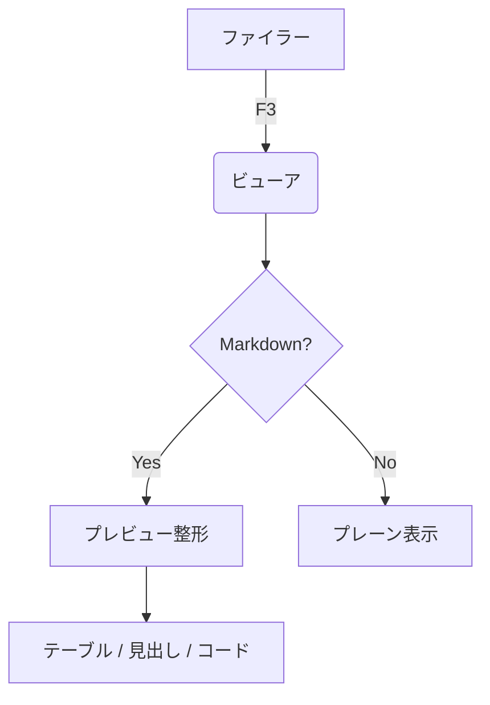
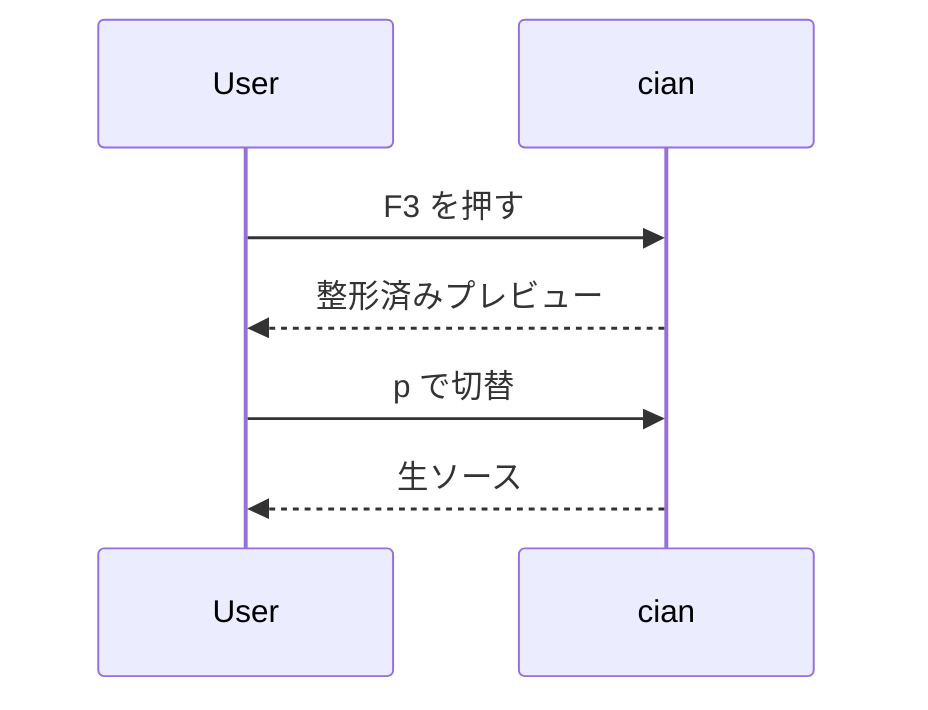

# cian の F3 Markdown プレビュー デモ

このファイルは **F3 ビューア**の Markdown 表示を確認するためのサンプルです。
ファイラーでこのファイルにカーソルを合わせて **F3**、`p` で「ソース ⇄ プレビュー」を切り替えられます。

## インライン記法

**太字**、*斜体*、`inline code`、そして [リンク](https://example.com) が同じ行に混在しても崩れません。
日本語（全角）も幅を考慮して整形されます：`あいうえお` と `abcde`。

## リスト

- 箇条書き（unordered）
  - ネストした項目
  - もう一つ
- `-` / `*` / `+` を受け付けます

1. 順序付き（ordered）
2. 2 番目
3. 3 番目

## テーブル

左寄せ・右寄せ・中央寄せをそれぞれ指定できます。列幅は内容から自動計算し、
罫線で囲みます（画面幅を超える場合は広い列から縮めて `…` で省略）。

| 項目           | 数量 | 状態      | 備考              |
|:---------------|-----:|:---------:|:------------------|
| りんご         |    3 | OK        | **在庫あり**      |
| みかん         |   12 | OK        | 産地: 和歌山      |
| ぶどう         |  120 | 取り寄せ  | `code` も出せる   |
| very-long-name |    1 | NG        | 幅超過時は省略対象 |

## 引用とルール

> これは blockquote です。
> 複数行にまたがっても左に縦線が付きます。

---

## コードブロック

```rust
fn main() {
    println!("hello, cian");
}
```

## mermaid（図の記述）

端末は図そのものを描けないので、mermaid ブロックは
「見出し付きのコード枠」として表示します（構文確認用）。





## 終わり

以上でひととおりの記法を網羅しています。表・見出し・コード・mermaid・引用・
リスト・インライン装飾が、それぞれ綺麗に出ていれば OK です。
