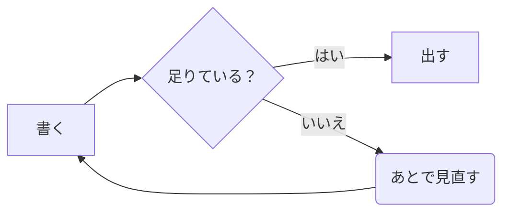

# amber へようこそ

**ここにあるのは、ただの Markdown ファイルです。**

データベースはありません。フォルダがそのまま索引で、`.md` がそのまま
ノート。amber を消しても、ノートは残ります ── Finder でも Explorer でも
VS Code でも、いつもどおり開けます。

このノートは初回だけ置かれるお試しです。**消してかまいません**（消しても
もう戻ってきません）。

---

## 三つの面（窓版）

| 面 | 何が見えるか | いつ使うか |
|---|---|---|
| **表示** | 組み上がった姿 | ふだん。ここでそのまま書けます |
| **並べて表示** | 左に Markdown、右に組んだ姿 | 記法を確かめながら書くとき |
| **コード** | Markdown そのもの | 細かく直すとき。vim も使えます |

`⌘E` で **表示 ⇄ コード**、`⌘P` で並べて表示。

> [!TIP]
> **表示の面で、そのまま打てます。** 「ここに書く」を押す手順はありません。
> 打ちたいところにカーソルを置いて、打ってください。

---

## 覚えておくと早いもの（窓版）

| 押すもの | 何が起きるか |
|---|---|
| `⌘N` | 新しいノート |
| `⌘E` | 表示 ⇄ コード |
| `⌘P` | 並べて表示 |
| `⌘⇧P` | コマンド一覧（**迷ったらこれ**） |
| `⌘⇧O` | 目次 |
| `F12` | ノートだけを大きく（戻るのも `F12` か `Esc`） |

思い出せないときは `⌘⇧P` を押してください。**できること全部が、名前で
探せる形で出ます。**

---

## 書けるもの

チェックリストは、**表示の面で押すだけ**で入ります。

- [x] amber を開いた
- [ ] 自分のノートを一つ書いた
- [ ] 図を押して直してみた（窓版）

引用と、注記。

> 書けるものは、だいたい書けます。

> [!NOTE]
> `> [!NOTE]` `> [!TIP]` `> [!IMPORTANT]` `> [!WARNING]` `> [!CAUTION]`
> の五つ。GitHub と同じ形なので、そのまま push しても崩れません。

コードは言語を書くと色が付きます。

```rust
// 題は title → 最初の見出し → 書き出しの一行 → ファイル名の順に決まる。
// 決めるのは一か所（amber-core）なので、窓も iPhone も同じ題を見る。
pub fn title(note: &Note) -> String { note.title.clone() }
```

---

## 図は、押すと直せます

下の図を **押して**みてください（窓版）。左に表、右に図が出て、表を直すと
図がその場で描き直ります。**mermaid の書き方は覚えなくてかまいません。**

iPhone でも同じ図が同じ色で出ます（直すのは窓版で）。



作るときは、下の道具の帯から **フロー**。流れ図・分かれ道・マインドマップ・
年表・予定表・四象限・やりとり・円グラフ の八つを、言葉を訊かれるだけで
作れます。

---

## 置き場所

ノートは一つのフォルダの中にあります。いまどこかは **⚙ → amber保存
ディレクトリ変更** で見られます（そこで移すこともできます）。

同期は amber がやりません。**Dropbox でも iCloud でも Git でも、そのフォルダ
ごと同期してください** ── ただの `.md` なので、どの道具とも喧嘩しません。
同じノートを二か所から書き換えたときは、保存の前に amber が訊きます。

---

## この先

- 左の **覚え書き** と **設計** のフォルダに、書き方の見本を二つ置きました
- タグは前書きの `tags:` に書くか、**ノート ▾ → ノートのタグ設定** から
- 探すのは上の欄。タグ・フォルダ・期間で絞るのは **フィルタ**
