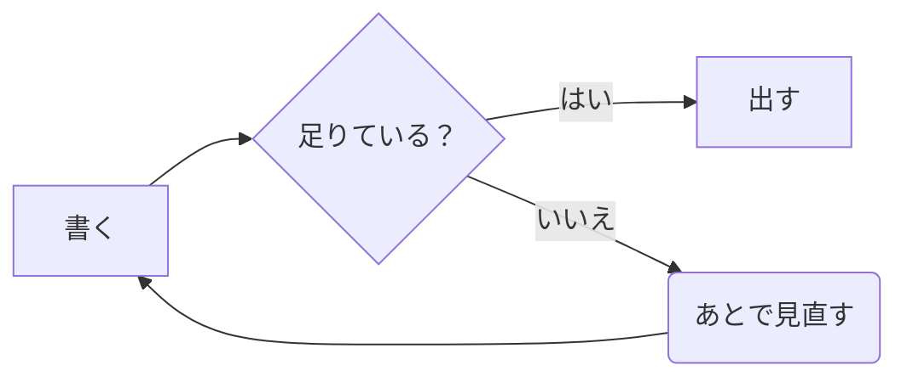
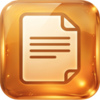

# ambər へようこそ

```amber
                     ██╗
                     ██║
██████╗  ██████████╗ █████╗   █████╗  ██████╗
╚═══██║  ██╔═██╔═██╗ ██╔═██╗ ██╔══██╗ ██╔══██╗
██████║  ██║ ██║ ██║ ██║ ██║ ███████║ ██║  ╚═╝
██╔══██║ ██║ ██║ ██║ ██║ ██║ ██╔══██║ ██║
╚█████╔╝ ╚═╝ ╚═╝ ╚═╝ ╚████╔╝ ╚█████╔╝ ╚═╝

note  ノート  笔记  메모  Notiz  nota  notatka
```

*Advanced Markdown Browser & Editor for Readability*

**ここにあるのは、ただの Markdown ファイルです。**

データベースはありません。フォルダがそのまま索引で、`.md` がそのまま
ノート。ambər を消しても、ノートは残ります ── Finder でも Explorer でも
VS Code でも、いつもどおり開けます。

このノートは初回だけ置かれるお試しです。**消してかまいません**（消しても
もう戻ってきません）。フォルダもタグも作らず、そのまま置いてあります。

---

## 三つの見せ方（パソコン版）

| 見せ方 | 何が見えるか | いつ使うか |
|---|---|---|
| **表示** | 整った見た目 | ふだん。ここでそのまま書けます |
| **並べて表示** | 左に Markdown、右に整った見た目 | 記法を確かめながら書くとき |
| **コード** | Markdown そのもの | 細かく直すとき。vim も使えます |

`⌘E` で **表示 ⇄ コード**、`⌘P` で並べて表示。

> [!TIP]
> **「表示」のまま、そのまま打てます。** 「ここに書く」を押す手順はありません。
> 打ちたいところにカーソルを置いて、打ってください。

---

## 覚えておくと早いもの（パソコン版）

| 押すもの | 何が起きるか |
|---|---|
| `⌘N` | 新しいノート |
| `⌘E` | 表示 ⇄ コード |
| `⌘P` | 並べて表示 |
| `⌘⇧P` | コマンド一覧（**迷ったらこれ**） |
| `⌘⇧O` | 目次 |
| `F12` | ノートだけを大きく（戻るのも `F12` か `Esc`） |

思い出せないときは `⌘⇧P` を押してください。**できること全部が、名前で
探せる形で出ます。**

---

## 書けるもの

チェックリストは、**「表示」で押すだけ**で入ります。

- [x] ambər を開いた
- [ ] 自分のノートを一つ書いた
- [ ] 図を押して直した（パソコン版）

引用と、注記。

> 書けるものは、だいたい書けます。

> [!NOTE]
> `> [!NOTE]` `> [!TIP]` `> [!IMPORTANT]` `> [!WARNING]` `> [!CAUTION]`
> の五つ。GitHub と同じ形なので、そのまま push しても崩れません。

コードは言語を書くと色が付きます。

```rust
// タイトルは title → 最初の見出し → 書き出しの一行 → ファイル名の順に決まる。
// 決めるのは一か所（amber-core）なので、パソコン版もスマホ版も同じ答えを見る。
pub fn title(note: &Note) -> String { note.title.clone() }
```

---

## 図は、押すと直せます

下の図を押すと直せます（パソコン版）。左に表、右に図が出て、表を直すと
図がその場で描き直ります。**mermaid の書き方は覚えなくてかまいません。**

スマホ版でも同じ図が同じ色で出ます（直すのはパソコン版で）。



作るときは、下のボタンの **図**。流れ図・分かれ道・マインドマップ・
年表・予定表・四象限・やりとり・円グラフ の八つを、言葉を入れるだけで
作れます。

---

## 置き場所

ノートはフォルダの中にあります（いくつでも）。いまどこかは **⚙ → 保存
ディレクトリの追加・変更・削除** で見られます（そこで移したり、足したりできます）。

同期は ambər がやりません。**Dropbox でも iCloud でも Git でも、そのフォルダ
ごと同期してください** ── ただの `.md` なので、どのアプリからも開けます。
同じノートを二か所から書き換えたときは、保存の前に ambər が確認します。

---

## 画像も貼れます



画像はノートの**隣の `attachments/` に置かれ**、本文にはリンクだけが入ります
── ノートを別の場所へ移すと、画像も一緒に付いていきます。

パソコン版は**貼り付け**（⌘V）でそのまま入ります。スマホ版は下のボタンの 🖼 から。

大きさを変えるには、**画像を押して「大きさ…」**。小さめ・中くらい・大きめ・
はばいっぱいから選べます。
選んだものは本文に `` と**そのまま書かれる**ので、
覚えている人はそのまま打ってもかまいません（`w:` `h:` `width:` `height:`）。

---

## この先

- 一緒に置いた **覚悟の磨き方** と **ストラテジーパターン** が、書き方の見本です
- タグは前書きの `tags:` に書くか、**ノート ▾ → ノートのタグ設定** から
- フォルダは左の列の **フォルダ ＋** から
- 探すのは上の欄。タグ・フォルダ・期間で絞るのは **フィルタ**
- 絵文字は下のボタンの **😀** から（スマホ版は顔の絵）── 日本語で探せます
  （「おめでとう」で 🎉）。入るのは絵文字そのものなので、どこで開いても読めます
- **テンプレート** というフォルダを作ると、その中のノートが型になります
  ── パソコン版もスマホ版も **＋ 新しいノート** の中の「テンプレートから作る」
