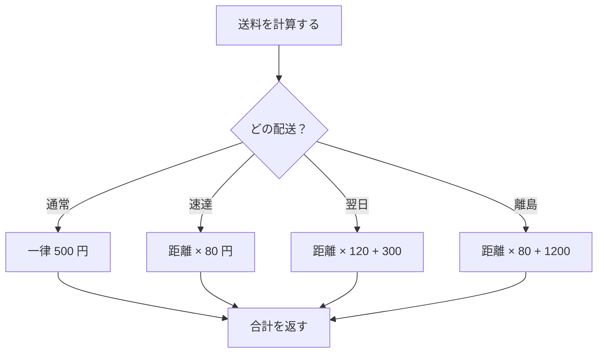
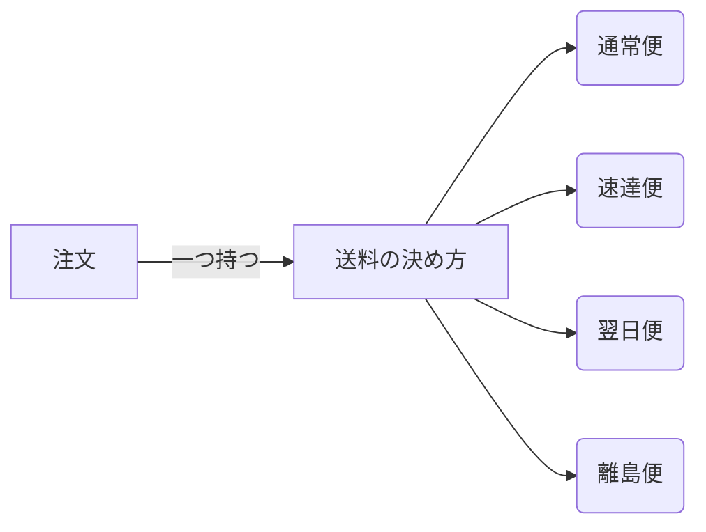
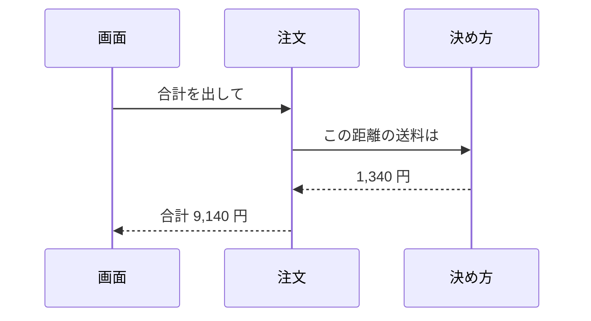
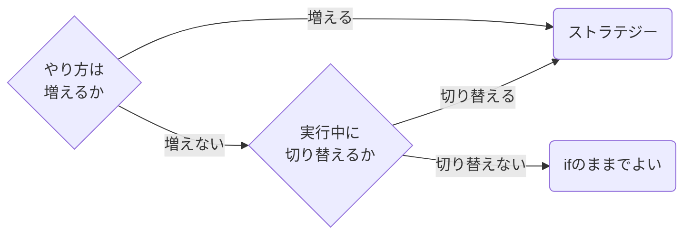

# ストラテジーパターン

**やることは同じ。やり方だけが違う。** そういう場面で、やり方のほうを
差し替えられる部品にしておく ── それだけのパターン。

GoF の分類では**振る舞い**に属する。効くのは「アルゴリズムが増える」と
分かっているところ。

---

## 何が問題だったか



配送の種類が増えるたびに、**この一つの関数を開いて中に足す**ことになる。
増えるのは分岐だけではない。

> [!WARNING]
> 分岐が増えると、**関係のない配送のテストまで毎回走る**。
> 「速達を足したら通常が壊れた」が起こりうる形になっている。

---

## 差し替えられる形にする



注文は「**送料の決め方**」を一つ持つ。中身が通常便か速達便かは知らない。
知らないので、増えても注文側は変わらない。

---

## 呼ばれ方



注文は毎回**同じ一つの問い**を投げる。答え方だけが差し替わる。

---

## 書くとこうなる

```rust
/// 送料の決め方。**注文はこの一つの問いしか知らない。**
trait Shipping {
    fn fee(&self, km: u32) -> u32;
}

struct Normal;
struct Express;
struct Island;

impl Shipping for Normal {
    fn fee(&self, _km: u32) -> u32 { 500 }
}
impl Shipping for Express {
    fn fee(&self, km: u32) -> u32 { km * 80 }
}
impl Shipping for Island {
    fn fee(&self, km: u32) -> u32 { km * 80 + 1200 }
}

struct Order {
    total: u32,
    km: u32,
    /// **決め方を持つ。中身が何かは知らない。**
    how: Box<dyn Shipping>,
}

impl Order {
    fn charge(&self) -> u32 {
        self.total + self.how.fee(self.km)
    }
}
```

新しい配送を足すときに触るのは、**新しい `impl` を一つ書くところだけ**。
`Order` は開かない。

---

## いつ効いて、いつ効かないか

| | 分岐のまま | ストラテジー |
|---|---|---|
| 種類を足す | 既存の関数を開く | 新しい型を足すだけ |
| テスト | 全部まとめて | 一つずつ独立して |
| 実行中に変える | 変数を持ち回る | 差し替えるだけ |
| 読む手間 | 一か所で全部見える | 追うファイルが増える |
| 種類が **2つ** | ちょうどいい | **やりすぎ** |

> [!IMPORTANT]
> **二つしか無いなら `if` でいい。** パターンは、増えると分かっている
> ものにだけ払う。増えない分岐に払うと、読む手間だけが増える。

判断の目安。



---

## 隣のパターンとの違い

| パターン | 差し替えるもの | 決めるのは |
|---|---|---|
| **ストラテジー** | やり方まるごと | 呼ぶ側 |
| テンプレートメソッド | 手順の一部 | 親クラス（手順は固定） |
| ステート | 状態ごとの振る舞い | 自分（次の状態も自分で決める） |

**ストラテジーは呼ぶ側が選ぶ**。ステートは自分で移る。ここが分かれ目。

---

## 使ったところ

ambƏr の中では、**題の決め方**がこれに近い形をしている ── `title:` →
最初の見出し → 書き出しの一行 → ファイル名、と順に試す。ただし決め方が
増える見込みが無いので、素直に上から順に見るだけにしてある。

> [!TIP]
> **払わない判断も設計。** パターンを知っていることと、そこで使うことは
> 別のこと。
